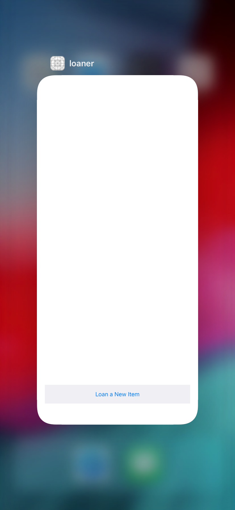

Let's learn about Core Data!

# Overview

???

# Learning Outcomes

By the end of this tutorial, students should be able to...

# Technical Planning

???

# Using Git/GitHub

Much like we've done in earlier tutorials, make sure you're committing your code as you complete milestones. At a minimum, you should make a commit whenever the tutorial prompts you.

# Set up Git/GitHub

Set up your repo!

> [action]
> Go to the [starter repo](https://github.com/Make-School-Labs/StarterApp-CoreData-iOS) and fork the repo into your own personal account

Doing this will allow you to commit/push/pull the changes you make to your own account. **It is very important you do the above step first before doing the below.**

> [action]
> Clone the starter project from your fork
>
```bash
$ git clone [URL to your starter repo] NAME_OF_LOCAL_REPO
$ cd NAME_OF_LOCAL_REPO
$ INSTALL_DEPENDENCIES
$ git add .
$ git commit -m 'project init'
```

>[action]
> Push it!
>
```bash
$ git remote add origin FORKED-GITHUB-REPO-URL
$ git push origin master -u
```

# Confirming Starter App State
We haven’t added any data persistence to the starter app yet, so nothing will be retained once the app is no longer in memory.

To validate the working state of the starter app, let’s add some user data, then remove the app from memory:

> [action]
> Do the following actions to validate the app:
>
> 1. From Xcode, launch the starter app in the Simulator
> 1. Create 2 or 3 loaned items
> 1. Completely remove the app from memory by double tapping the Home button or slowly drag upward from the bottom of the screen
> 1. If that doesn't work, use `[Cmd]+[Shift]+H+H`, to reveal all apps in memory
> 1. When the Loaner app in the Fast App Switcher as seen below, swipe upward to remove it from memory



Click on the Loaner app icon to relaunch it. None of the loaned items you previously created should be present.

> [info]
>
> If Fast App Switching does not work in the Simulator, try removing all apps from memory by selecting Hardware —> Restart from the Simulator’s menu.

We've got a ways to go in order to fully get the data to persist after a memory removal, so let's get started by building out our model for CoreData!
