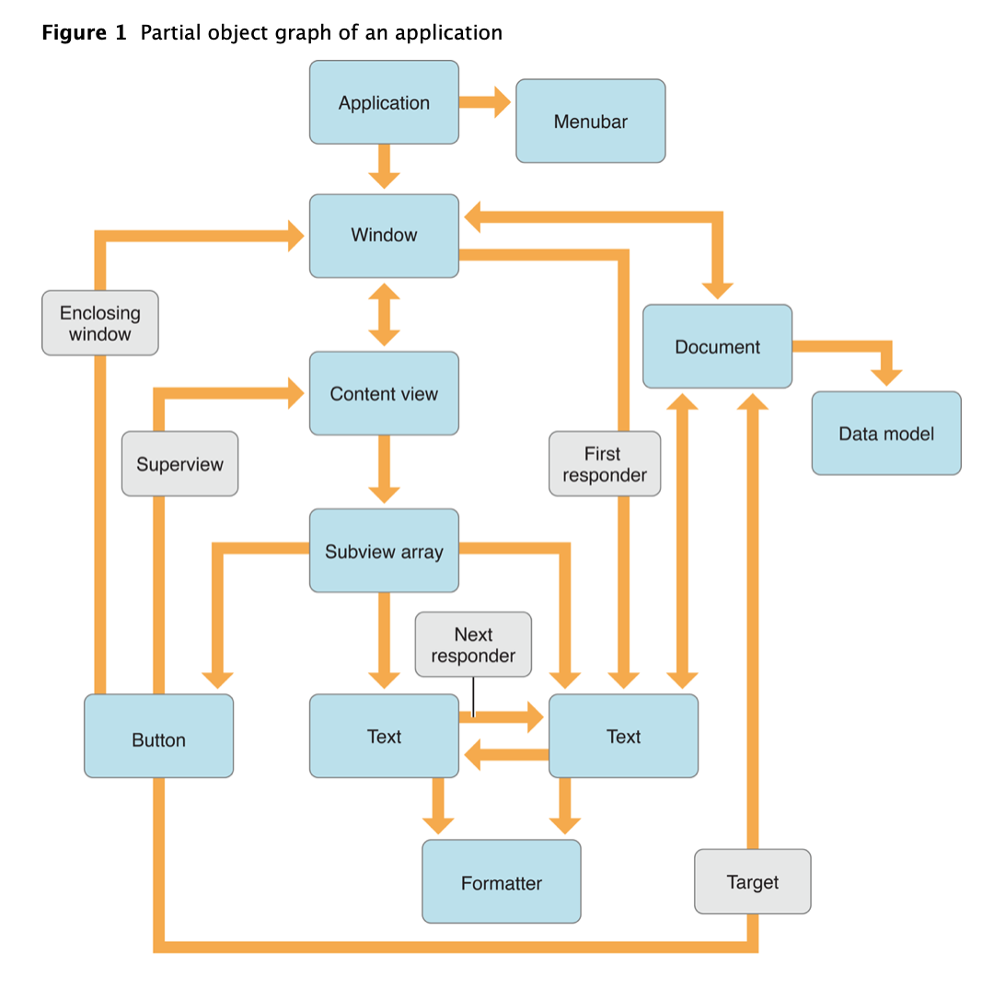
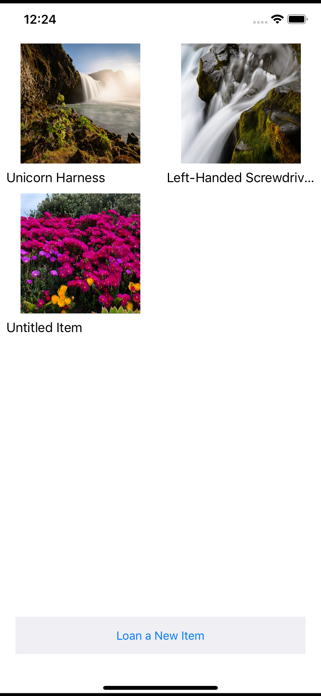
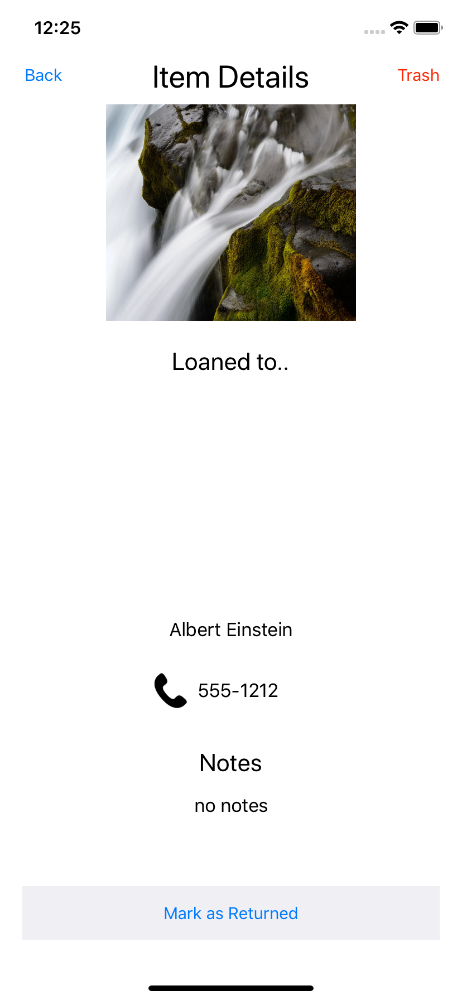
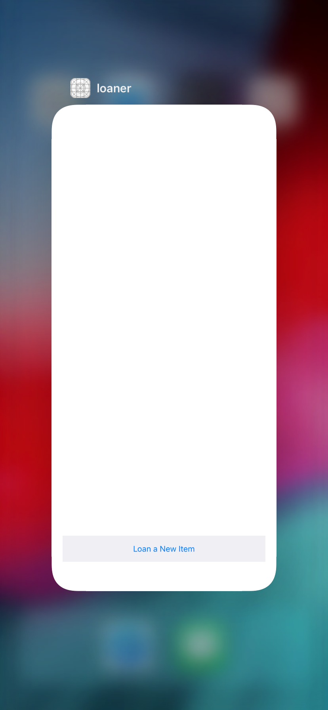

In this tutorial, you'll be given a loaner app that you will add persistence functionality to. In the app you can add items that you want to loan to people. Each item has a picture and a name, and also allows for the option to add notes. Once you add the item, you can then add the name and phone number of the person you're loaning the item to. From there you can track who you've loaned your items to, and can mark them as returned or delete them as well.

If you play around with the app though, you may notice a glaring issue. If the app gets removed from memory, all of the data and items stored in the app will disappear! This is a huge flaw in a system that's supposed to always track who has your stuff!

We can avoid these situations by utilizing persistent storage in our apps. One way to do this is by using **Core Data**. In this tutorial, we'll be taking this loaner app and adding persistent storage to it using Core Data.

> [info]
>
> Check out the [Core Data Documentation](https://developer.apple.com/documentation/coredata) to get more information!

**NOTE:** There's going to be a lot of terminology in this tutorial. There is an appendix at the very end with definitions of terms, so please reference that if you ever need a reminder on terms while going through this tutorial.

# What is Core Data?

Core Data is a framework from Apple that allows you to create and describe your model objects and their relationships to one another.

It is responsible for the lifetimes of these objects, ensuring their relationships are kept consistent and up to date. If you want to be able to preserve data in an app beyond the life of a single app session, then you need to implement a type of persistent storage such as Core Data. Imagine if you couldn't save your home address in google maps, or if you had to re-add all of the people you follow on social media every time you opened the app.

Because these objects can be thought of as nodes, and their interrelationships as vertices in a mathematical graph, such a collection of objects is often referred to as an **object graph**, as seen below:



**Core Data is not:**

- An Object-Relational-Mapping (ORM) system
- A database

# Learning Outcomes

By the end of this tutorial, students should be able to...

1. Implement a Core Data model using Xcode's Model editor
1. Build the various parts that make up the Core Data stack, usage such as entities, the managed object, and the persistent store
1. Save, fetch, and delete data from persistent storage through Core Data

# Technical Planning

In order to integrate Core Data into our loaner app, we'll have to build it out piece by piece:

1. Build out the Core Data Model
1. Create the Managed Object
1. Build the Core Data Stack
1. Implement Saving Data
1. Implement Fetching Data
1. Implement Deleting Data

# Using Git/GitHub

Much like we've done in earlier tutorials, make sure you're committing your code as you complete milestones. At a minimum, you should make a commit whenever the tutorial prompts you.

# Set up Git/GitHub

Set up your repo!

> [action]
> Go to the [starter repo](https://github.com/Make-School-Labs/loanerAppCD-starter) and clone the repo locally
>
```bash
$ git clone git@github.com:Make-School-Labs/loanerAppCD-starter.git
```

Now we need to change the remote so that you can commit/push/pull the changes you make to your own repo. **It is very important you do the below steps in order to get everything working properly.**

> [action]
> Go to GitHub and create an _empty_, public repository called REPO-NAME, and now associate it as a remote for your cloned starter code, and then push to it.
>
```bash
$ cd loanerAppCD-starter
# can grab the url from the "Clone or download" link on your repo page
$ git remote set-url origin git@github.com:YOUR_USERNAME/REPO-NAME
$ git push -u origin main
```

Go to your repo on GitHub and make sure your previously empty repo is now full with starter code! Now when you add/commit/push, it'll be to your repo!

Build and run the app to confirm that it loads properly. You should see something like the following, after you have made some items:

**Main Screen**



**Item Details Screen**



# Confirming Starter App State
We haven’t added any data persistence to the starter app yet, so nothing will be retained once the app is no longer in memory.

To validate the working state of the starter app, let’s add some user data, then remove the app from memory:

> [action]
> Do the following actions to validate the app:
>
> 1. From Xcode, launch the starter app in the Simulator
> 1. Create 2 or 3 loaned items
> 1. Completely remove the app from memory by slowly drag upward from the bottom of the screen
> 1. If that doesn't work, use `[Cmd]+[Shift]+H+H`, to reveal all apps in memory
> 1. When the Loaner app in the Fast App Switcher as seen below, swipe upward to remove it from memory



Click on the Loaner app icon to relaunch it. None of the loaned items you previously created should be present.

> [info]
>
> If Fast App Switching does not work in the Simulator, try removing all apps from memory by selecting Hardware —> Restart from the Simulator’s menu.

We've got a ways to go in order to fully get the data to persist after a memory removal, so let's get started by building out our model for CoreData!
