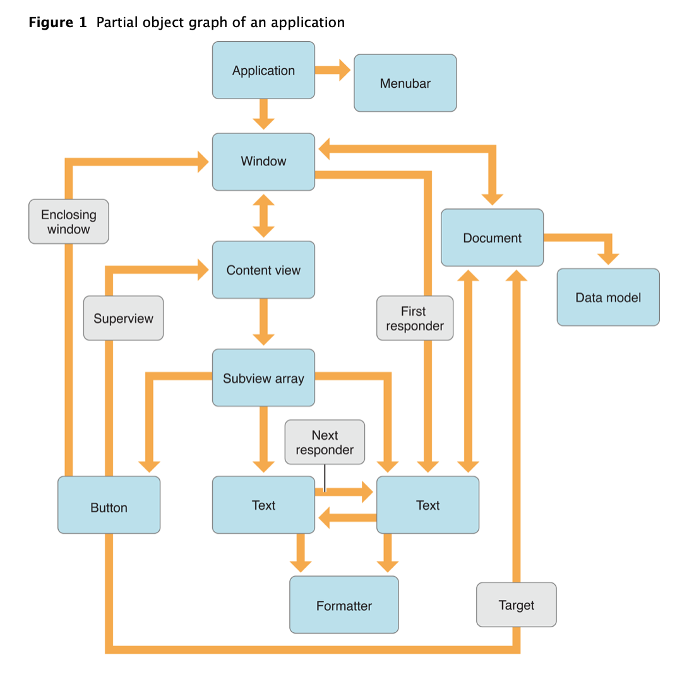
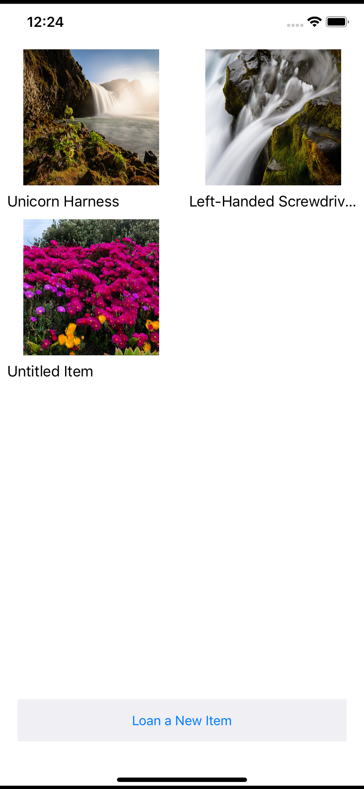
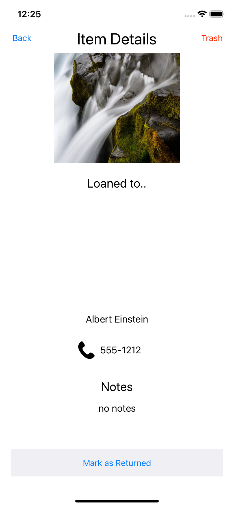

Have you ever built or used an app where the data wasn't saved after you swiped it away? Imagine your todo list app on your phone wiped everything away if you ejected the app from memory, or if you had to re-write your grocery list every time you did a fresh start of your app? It would be a pretty painful experience.

We can avoid these situations by utilizing persistent storage in our apps. One way to do this is by using **Core Data**. In this tutorial, we'll be taking an app that tracks items and who they were loaned to, and adding persistent storage to it using Core Data.

> [info]
>
> Check out the [Core Data Documentation](https://developer.apple.com/documentation/coredata) to get more information!

# What is Core Data?

Core Data is a framework from Apple that allows you to create and describe your model objects and their relationships to one another.

It is responsible for the lifetimes of these objects, ensuring their relationships are kept consistent and up to date.

Because these objects can be thought of as nodes, and their interrelationships as vertices in a mathematical graph, such a collection of objects is often referred to as an **object graph**, as seen below:



**Core Data is not:**

- An Object-Relational-Mapping (ORM) system
- A database

# Learning Outcomes

By the end of this tutorial, students should be able to...

1. Implement a Core Data model using Xcode's Model editor
1. Build the various parts that make up the Core Data stack, usage such as entities, the managed object, and the persistent store
1. Save, fetch, and delete data from persistent storage through Core Data

# Technical Planning

In order to integrate Core Data into our loaner app, we'll have to build it out piece by piece:

1. Build out the Core Data Model
1. Create the Managed Object
1. Build the Core Data Stack
1. Implement Saving Data
1. Implement Fetching Data
1. Implement Deleting Data

# Using Git/GitHub

Much like we've done in earlier tutorials, make sure you're committing your code as you complete milestones. At a minimum, you should make a commit whenever the tutorial prompts you.

# Set up Git/GitHub

Set up your repo!

> [action]
> Go to the [starter repo](https://github.com/Make-School-Labs/StarterApp-CoreData-iOS) and fork the repo into your own personal account

Doing this will allow you to commit/push/pull the changes you make to your own account. **It is very important you do the above step first before doing the below.**

> [action]
> Clone the starter project from your fork
>
```bash
$ git clone [URL to your starter repo] NAME_OF_LOCAL_REPO
$ cd NAME_OF_LOCAL_REPO
$ git add .
$ git commit -m 'project init'
$ git push origin master
```

<!-- -->

> [info]
>
> If you run in to a git error about setting up a remote origin, follow the steps below:
>
```bash
$ git remote add origin FORKED-GITHUB-REPO-URL
$ git push origin master -u
```

Build and run the app to confirm that it loads properly. You should see something like the following, after you have made some items:

**Main Screen**



**Item Details Screen**



# Confirming Starter App State
We haven’t added any data persistence to the starter app yet, so nothing will be retained once the app is no longer in memory.

To validate the working state of the starter app, let’s add some user data, then remove the app from memory:

> [action]
> Do the following actions to validate the app:
>
> 1. From Xcode, launch the starter app in the Simulator
> 1. Create 2 or 3 loaned items
> 1. Completely remove the app from memory by double tapping the Home button or slowly drag upward from the bottom of the screen
> 1. If that doesn't work, use `[Cmd]+[Shift]+H+H`, to reveal all apps in memory
> 1. When the Loaner app in the Fast App Switcher as seen below, swipe upward to remove it from memory


Click on the Loaner app icon to relaunch it. None of the loaned items you previously created should be present.

> [info]
>
> If Fast App Switching does not work in the Simulator, try removing all apps from memory by selecting Hardware —> Restart from the Simulator’s menu.

We've got a ways to go in order to fully get the data to persist after a memory removal, so let's get started by building out our model for CoreData!
