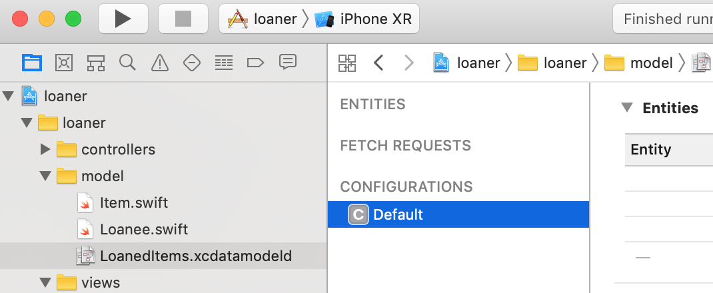
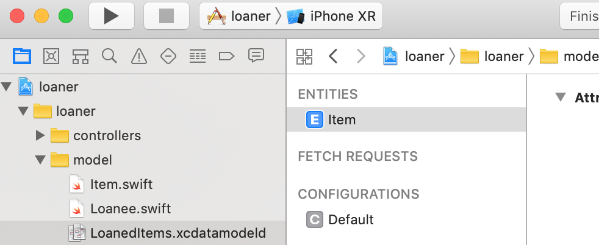
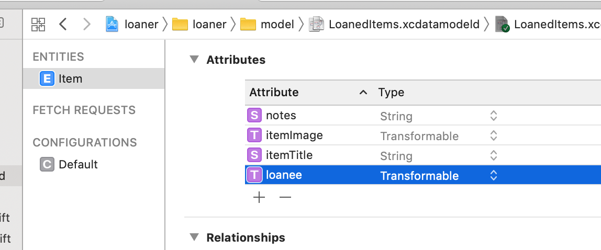
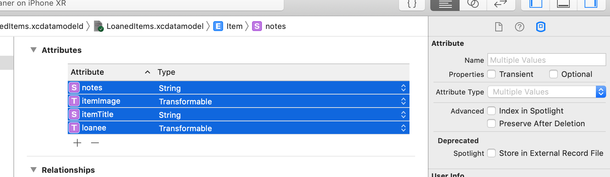

Much of Core Data’s functionality depends on the schema we create to describe the application’s entities, their properties, and the relationships between them. Core Data uses a schema called a managed object model — an instance of NSManagedObjectModel.

# Adding the CoreData Model File

To start the CoreData implementation, we will add a new Data Model file to the baseline starter app’s existing model group.

> [action]
>
> Select `File --> New --> File..`, make sure that the iOS template is highlighted, search for `Data Model` and select that template.
> When prompted to `Save As`, name the new model file `LoanedItems.xcdatamodeld`, and save it under `/loaner/model/`
>
> 

At runtime, CoreData will use the `LoanedItems.xcdatamodeld` file to programmatically create an instance of `NSManagedObjectModel` that is an in-memory representation of the `.xcdatamodeld` file, which describes the managed objects.

# Modeling Entities

The **managed object model** allows Core Data to map from records in a persistent store to managed objects that we use in our application.

The managed object model is a collection of **entity description objects**, which are instances of `NSEntityDescription`.

An entity description describes an entity in terms of:

- its name
- the name of the class used to represent the entity in our application
- its properties (attributes and relationships)

> [info]
>
> We can think of entities as tables in a database. Their names are also the names of the classes (subclasses of `NSManagedObject`) used to represent the entities in our application.

Let's create an entity of our own:

> [action]
>
> 1. Select the `LoanedItems.xcdatamodeld` file in the `Project Navigator` pane to display CoreData’s `Data Model Editor`.
> 1. Click the `Add Entity` button in the lower left corner of the `Model Editor` to create a new entity (or find it in Xcode's Editor dropdown menu). A new entity with the default name `Entity` should appear in the `Entities` list in the `Model Editor`’s navigator pane.
>1. Change the new entity’s name to `Item`



# Adding Attributes

The attributes we can add to an entity are also represented as properties in the `NSManagedObject` subclasses.

> [action]
>
> Add the list of `notes`, `itemImage`, `itemTitle`, and `loanee` attributes depicted below to our `Item` entity. Note that attribute order may differ, but the **Type assigned to each Attribute should match the Type shown for each in the list below**:
>
> 

Double check that our attributes have the correct name and Type!

# Optional & Non-Optional Attributes

The Data Model Editor makes all attributes `optional` by default.

But the terms `Optional` and `Non-Optional` have markedly different meanings in Swift and CoreData.

Because CoreData was designed to be used by multiple platforms (iOS, macOS) and languages (Objective-C, Swift), it is compiled directly to Objective-C and hence is unaware of purely Swift constructs like optionals, structs, and so on.

CoreData was also designed to handle the transaction details of databases, such as SQLite, where it is common to specify whether or not the insertion of NULL values is allowed for a given column.
Marking an attribute as `optional` does not imply that it is a Swift `optional`: It means that during runtime CoreData will create a database record that optionally allows NULL values if the property does not contain data.

But we do need this feature or the complexities it can add, so let’s change all our attributes to non-optional:

> [action]
>
> Select all the attributes, open the Data Model Inspector, and uncheck the Optional checkbox.

The end result of this should look like the below image:



**If an attribute is not optional, it must have a non-nil value when we save changes to the Managed Object Context.** But at other times, Core Data does not care if the attribute is `nil`.

Because these properties are not optional, we will need to provide values for them at object creation time.

But we will do that later on!

# Transformable Attributes

Notice that the values for the `loanee` and `itemImage` attributes are both of the `Transformable` type.

CoreData is only capable of storing certain data types. However, neither of the respective data types for those two attributes — `Loanee` and `UIImage` — can be used by CoreData directly. Declaring them as `Transformable` lets CoreData convert their objects into a type it can store, and then convert it back in to the original types when loading from the filesystem.

Transformable attributes require an `NSValueTransformer` subclass to handle conversions.

> [info]
>
> If not specified, the system will use a default transformer which uses archiving to convert the objects to and from NSData objects.
>
> Read more about `NSCoding` [here](https://developer.apple.com/documentation/foundation/nscoding)

Since `UIImage` conforms to `NSSecureCoding` (an extension of `NSCoding`), the default transformer will be fine.

But because `Loanee` does not conform to `NSCoding`, we must modify it to conform to the `NSCoding` protocol.

> [action]
>
> Update the `Loanee.swift` class to match the following:
>
```swift
import UIKit
>
class Loanee: NSObject, NSCoding {
>
    var name: String
    var contactNumber: String?
>
    // Protocol requires having Keys for our variables
    enum Keys: String {
        case name = "name"
        case contactNumber = "contactNumber"
    }
>
    init(name: String, contactNumber: String?) {
>
        /** For Future Feature: Ability to access Contacts app:
         init(name: String, profileImage: UIImage, contactNumber: String?) {
>
         self.profileImage = profileImage
         **/
>
        self.name = name
        self.contactNumber = contactNumber
    }
>
    // Protocol requires an encode method to encode our variables based on the Key
    func encode(with aCoder: NSCoder) {
        aCoder.encode(name, forKey: "name")
        aCoder.encode(contactNumber, forKey: "contactNumber")
    }
>
    // Protocol requires an init method which acts as a decoder for our variables based on the Key
    required init?(coder aDecoder: NSCoder) {
        name = aDecoder.decodeObject(forKey: "name") as! String
        contactNumber = aDecoder.decodeObject(forKey: "contactNumber") as? String
        super.init()
    }
}
```

In the next chapter, we will create a custom Managed Object subclass to represent the `Item` entity!

# Now Commit

>[action]
>
```bash
$ git add .
$ git commit -m 'Created entity and attributes'
$ git push
```
