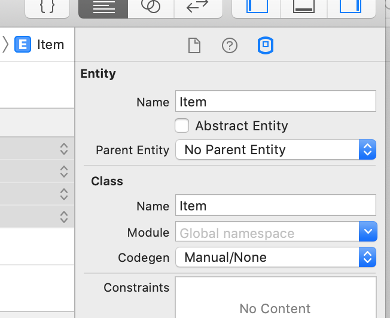
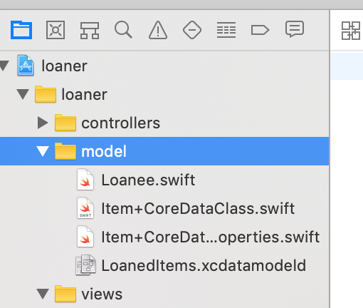

1. ~~Build out the Core Data Model~~
1. **Create the Managed Object**
    1. **Copy `Item.swift` for later use**
    1. **Auto-generate Core Data subclass and extension files**
    1. **Update the `NSManagedObject` file to include functionality from `Item.swift`**
    1. **Update the properties extension**
    1. **Fix build errors we introduced**
1. Build the Core Data Stack
1. Implement Saving Data
1. Implement Fetching Data
1. Implement Deleting Data

We just created our `Item` entity, but we really want to create a custom Managed Object subclass to represent it instead. A **Managed Object** is used to represent the entities in the application. Changing it to this subclass will allow us to use it with Core Data.

First back up the `Item.swift` file by saving a copy of it to Desktop or some other safe place — we will need revisit it shortly, but we need to delete the file in its current location so that we can do the subclass creation without conflict in Xcode.

> [action]
>
> Back up the `Item.swift` file:
>
```bash
$ cd MOB_2.1_Tutorial_Starter_App/loaner/model/
$ cp Item.swift ~/Desktop/Item.swift
```
>
> Then, delete the `Item.swift` file from the project. Make sure to select **"Move to Trash"**

# Auto-Generating the Managed Object

We are going to let Core Data auto-generate the Managed Object subclass:

> [action]
>
> Select the `LoanedItems.xcdatamodeld` file and click on the `Item` entity. Open the Data Model Inspector, and under `Class --> Codegen`, change the  dropdown option to `Manual/None`:
>
> 

Next we'll need to do a series of steps to create the Core Data files:

> [action]
>
> 1. From `Editor`,  select the `Create NSManagedObject Subclass` option
> 1. When prompted, ensure the `LoanedItems` Data Model presented has a **checkmark** in the `Select` column, and hit the `Next` button
> 1. On the next screen, ensure the `Item` under `Entity` has a checkmark, and hit `Next`
> 1. Place the files at the top level, and then press the `Create` button to finish the creation process. Now move them to the `model/` group:
>
> 

This will result in Xcode creating the following 2 Core Data specific files:

- **`Item+CoreDataClass.swift`**: The Xcode-generated subclass of `NSManagedObject`.
- **`Item+CoreDataProperties.swift`**: A Swift extension of `Item+CoreDataClass` that contains all of its attributes and provides an entity-specific class method for creating a fetch request.


## IMPORTANT DEBUG NOTE

If you ever experience Xcode not being able to find `Item`, or if you need to change the model file, delete both of the above files, restart Xcode, and repeat the steps to generate the `NSManagedObject`

> [info]
>
> Notice the `@NSManaged` attribute in `Item+CoreDataProperties.swift` extension file. **This attribute informs the Swift compiler that Core Data will provide the declaration’s storage and implementation at runtime.** Applying this attribute also implies the `objc` attribute.

# Updating the Managed Object Class

Now, let’s add back the functionality from the original `Item.swift` file.

> [action]
>
> Open the `Item.swift` file we previously saved as back up

Let's review what we need to grab from here:

- Because Core Data handles the initialization of its managed objects, we no longer need the two `init` methods in the original file.
- All of the original properties have been auto-generated as `@NSManaged` properties in the new `Item+CoreDataProperties.swift` extension file, therefore we no longer need them
- _We do need the `assignLoanee` function._ However, because Core Data can only generate classes, `Item` is no longer a Swift struct. So the `assignLoanee` function no longer needs to be `mutating`.

> [action]
>
> Copy the `assignLoanee` function from `Item.swift` into `/model/Item+CoreDataClass.swift`, but remove `mutating`. We'll also need to copy the following imports:
>
```Swift
import Foundation
import UIKit.UIImage
import CoreData
>
@objc(Item)
public class Item: NSManagedObject {
    func assignLoanee(name: String?, phoneNumber: String?) {
>        
        //validate contact has at least one number
        guard let contactNumber = phoneNumber else {
            return print("this contact needed to have at least one number")
        }
>        
        if let contactName = name {
>            
            //update loanee var
            let newLoanee = Loanee(
                name: contactName,
                contactNumber: contactNumber
            )
            loanee = newLoanee
        } else {
            loanee = nil
        }
    }
}
```

Because of the changes we’ve made, the loanee variable in the `assignLoanee` function can no longer be `nil`, so we will have to initialize it with default values:

> [action]
>
> Edit the `else` statement in the `assignLoanee` method in `/model/Item+CoreDataClass.swift` to the following
>
```swift
} else {
    loanee = Loanee.init(name: "no name", contactNumber: "no contact number")
}
```

When `Item` objects are added to the underlying database, they are sent the `awakeFromInsert` message.

Thus, we will need to override the `awakeFromInsert` function in our `Item` class to give initial values to key properties:

> [action]
>
> Add the following function to `/model/Item+CoreDataClass.swift`
>
```swift
override public func awakeFromInsert() {
    super.awakeFromInsert()
>
    // Give properties initial values
    itemTitle = "Untitled Item"
   	notes = ""
    itemImage = UIImage(named: "no item image")!
    loanee = Loanee(name: "", contactNumber: "")
}
```

The entire `/model/Item+CoreDataClass.swift` file should now look like the following:

```swift
import Foundation
import UIKit.UIImage
import CoreData

@objc(Item)
public class Item: NSManagedObject {

    override public func awakeFromInsert() {
        super.awakeFromInsert()

        // Give properties initial values
        itemTitle = "Untitled Item"
        notes = ""
        itemImage = UIImage(named: "no item image")!
        loanee = Loanee(name: "", contactNumber: "")
    }

    func assignLoanee(name: String?, phoneNumber: String?) {

        //validate contact has at least one number
        guard let contactNumber = phoneNumber else {
            return print("this contact needed to have at least one number")
        }

        if let contactName = name {
            //update loanee var
            let newLoanee = Loanee(
                name: contactName,
                contactNumber: contactNumber
            )
            loanee = newLoanee
        } else {
            loanee = Loanee.init(name: "no name", contactNumber: "no contact number")
       }
    }
}
```


# Updating the Properties Extension

> [action]
>
> Make the following changes to the `/model/Item+CoreDataProperties.swift` file:
>
> - Change all properties to non-optionals by removing their question marks (“?”)
>
```Swift
@NSManaged public var itemImage: NSObject
@NSManaged public var itemTitle: String
@NSManaged public var loanee: NSObject
@NSManaged public var notes: String
```
> - Change the `Loanee` property’s type from `NSObject` to `Loanee`:
>
```swift
@NSManaged public var loanee: Loanee
```
> - Change the `itemImage` property from `NSObject` to `UIImage`, and import `UIKit.UIImage` to satisfy the compiler:
>
```swift
import UIKit.UIImage
>
...
>
@NSManaged public var itemImage: UIImage
```

The `/model/Item+CoreDataProperties.swift` extension file should now look like the following:

```swift
import Foundation
import CoreData
import UIKit.UIImage

extension Item {

    @nonobjc public class func fetchRequest() -> NSFetchRequest<Item> {
        return NSFetchRequest<Item>(entityName: "Item")
    }

    @NSManaged public var itemImage: UIImage
    @NSManaged public var itemTitle: String
    @NSManaged public var loanee: Loanee
    @NSManaged public var notes: String
}
```

# Adapting Project Code to Core Data

## Adapting the Loaner Class

In the real world, adding Core Data to a project will likely require changes to existing code.

In the `/model/Item+CoreDataProperties.swift` extension file, the `Loanee` property is invoking an error stating the following:

`“Property cannot be declared public because its type uses an internal type.”`

To fix this, we need to declare the **access type** of the `Loanee` class and its externally used functions as `public` to match the `access type` of this property’s declaration in the extension.

> [action]
>
> Add the `public` modifier to the class declaration and to the two `NSCoding` function signatures in the `/model/Loanee.swift` file:  
>
```swift
public class Loanee: NSObject, NSCoding {
>
...
>
public func encode(with aCoder: NSCoder) {
>
...
>
required public init?(coder aDecoder: NSCoder) {
```


## Adapting to Core Data Non-Optionals

Recall that after auto-generating the Managed Object files, we removed the "?" from each property, changing each property to a Swift non-optional type.

> [action]
>
> Why did we change these to Swift non-optionals? Think about this before looking at the solution below

<!-- -->

> [solution]
>
> Since we set default values for the Managed Object’s properties in the `/model/Item+CoreDataProperties.swift` extension, we know that the database record will not have NULL values when Core Data saves the object.
>
> In addition, because we can count on Core Data’s dynamic runtime to create an instance of the Managed Object when needed, the extra work necessary to handle these as `optionals` is not required.

Because these properties have been changed to Swift non-optionals, we will need to change the existing code in places where those properties are referenced.

> [action]
>
> Build the project to generate Xcode errors.

There should be ~5 errors and 1 warning.

For now, we'll ignore the error in the `createNewItem` function in the `ViewController` class (don't worry, we'll fix it shortly) to focus on the other errors related to our changed properties.

> [action]
>
> In `ItemContactInfoViewController.swift`, find the `pressSave` function and fix the errors about `…Optional chaining` by removing the question marks on these lines:
>
```swift
item.loanee.name = nameFromUserInput
item.loanee.contactNumber = phoneNumFromUserInput
```

Next we'll open up `ItemDetailedViewController.swift` and fix the errors in there:

> [action]
>
> In `ItemDetailedViewController.swift`, fix the `Initializer for conditional binding must have Optional type, not ‘Loanee’…` error in the `updateUI` function by replacing the optional binding block `(if let loanee...)` with these three lines of code:
>
```swift
let loanee = item.loanee
labelLoaneeName.text = loanee.name
loaneePhoneNumLabel.text = loanee.contactNumber
```

Great, but we have one more error to fix in this file:

> [action]
>
> In `ItemDetailedViewController.swift`, fix the `Cannot force unwrap value of non-optional type ‘Loanee’…` error in the `pressMarkAsReturned` function by removing the “!”:
>
```swift
message: "Are you sure you want to mark this item, \(item.itemTitle), as returned from \(item.loanee.name)?",
```

The project should now have only 1 warning and the single error in the `createNewItem` function remaining.

We’ll correct that last error soon, but for now, we've **implemented our managed object!** Let’s fill out the Core Data Stack by adding other key components to the project!

# Now Commit

>[action]
>
```bash
$ git add .
$ git commit -m 'Created the managed object'
$ git push
```
